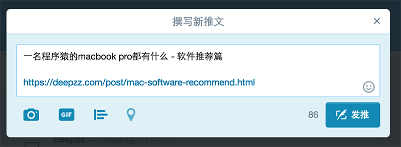
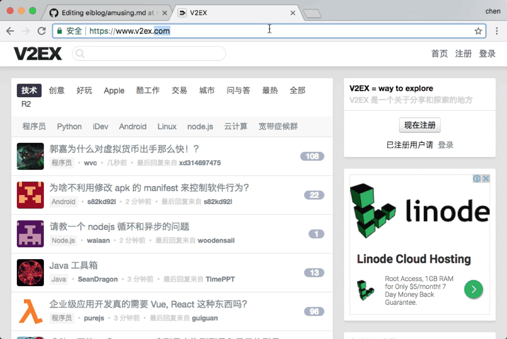

### Twitter Card
相信很多人不明白为什么会这样专注 twitter。首先 twitter 是一个社交网站，国际性的。其次我们可以使用它的Twitter Card 功能非常的酷。

当你配置好 Twitter 相关的参数后`conf/app.yml`：
```
# twitter地址: twitter.com/chenqijing2
twitter: 
  card: summary
  site: chenqijing2
  image: st.deepzz.com/static/img/avatar.jpg
  address: twitter.com/chenqijing2
```

每当你发部一个推文，你如果带上你的网址，它会自动给你展示成卡片的形式




可以看到`，`之前是没有内容的，该内容是我们文章的描述。

### Google OpenSearch
在 Chrome 浏览器上，你可以在输入网站后按 TAB 键进入搜索模式，如：


